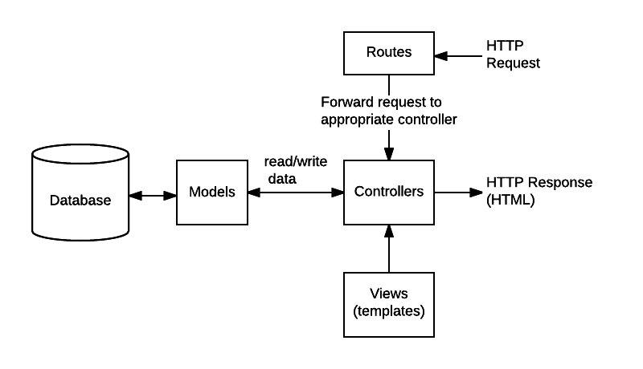

**DbApi**

DbApi is the backend server for the TssgTech database/calendar project. It is
developed in node.js utilizing node express. It does not return html pages. It
returns Ajax Json response to requests. Building the server accomplished by the
backend docker container build process and will not be covered here. The intent
of this document is to describe the API calls and the paths they take during
execution.

General Layout

Under the DbApi project folder several folders and files can be found. Most, but
not all will be explained here.

**Server.js –** This is the main server file where everything is pulled
together. JavaScript is a script language and as such is not compiled. Server.js
is the file that is ‘executed’ to start the backend service. The execution can
be by any system that can execute a JavaScript process. Currently, the backend
services are being executed by a node server. Examining the server.js file can
give you an insight into the general operation of the backend server. Many items
are declared and initialized in server.js.

Server.js is the beginning of the backend process but it quickly divides in four
main paths. In some ways, threads may be a better word in place of paths, but
these are not necessarily processing threads, so I chose to call them paths. The
name of these four paths are users, teams, meetings, and venues. The next three
main folders each contain four files containing a path name. Server.js is where
the server connects to the Mongo database in addition to the http/https servers.

**controllers –** The controllers folder contains a file
(\<path\>.controller.js) for each path. Each file contains a number of end-point
functions. This is where the backend interfaces with the Mongo database. Each
controller file maps directly to a Mongo database collection. User.controller.js
maps to the user collection. Team.collection.js maps to the team collection.
Meetings.contorller.js maps to the meetings collection. And venue.controller.js
maps to the venue collection. Notice that each controller exports the end points
as an array of functions. I will cover some of the functions a little bit later
in this document.

**models –** The models folder contains a model (schema) for each controller.
The schema defines the names, data types, and other attributes of a Mongo
collection. A model is like a class. By convention model names begin with a
capital letter. At or near the bottom of the file you will find an export
statement where the scheme name is exported as the model name. i.e.
*module.exports = mongoose.model(‘User’, UserSchema);* adds the UserSchema as
‘User’ to the module.exports. In the user.controller.js file you will see many
references to ‘User’. The same correlation exists between the other three models
and the like named controller.

**routes -** A route is a section of Express code that associates an HTTP verb
(GET, POST, PUT, DELETE, etc.), a URL path/pattern, and a function that is
called to handle that pattern. In server.js there are a number app.use( )
statements. These statements are used to configure ‘app’ which is our name for
our Express module. The use statements with the format of app.use(\<string
pattern\>, \<controller name\>) map inbound urls beginning with a specific
string pattern to specific controllers. This is how Express links a request to a
controller. Additionally, because only requests for a specific string pattern
will be directed to a specific controller, the string pattern is considered
redundant and is deleted from the route definitions. In this implementation, the
string patterns we use are the collection names. Therefore, we have a app.use( )
definition for each collection.

**views (templates) –** We are using Angular to develop our views and view
routing. It is a separate project (DbApp) which contains its own documentation.
For this reason and because we are not using any Express views or templates,
there is nothing to cover here.

Above we have described one file (server.js) and three folders (controllers,
models, and routes.) In each of these three folders you will find four files.
One each for user, team, meeting, and venue. Because of the naming convention
and the separation of functionality, it is much easier to develop, debug, and
support this project.

 ***Fig. 1. Server.js request/response flow.*** 

**Note:** Views (templaments) have not been implemented in the backend code. This work 
is accomplished by Angular, in the frontend.

Let us follow a request through the above diagram:

Request: The sender sets the http.method to ‘get’ and URL to
<https://backend/users>

The above request is received in server.js. Because the method is ‘get’ and the
URL path begins with /users, it attempts to match a get function in
user.route.js. In this case it would find

“.get(‘/’, authorize([Role.Admin]), user_controller.findAll)”

Notice ‘/users’ has not been declared in the path but server.js searches
user.route.js because of the app(‘/users’, user) statement mentioned above. In
this case it matches a get statement with no additional path component. The next
component in the route is a function call to authorize requiring the logged-on
user to have the Role.Admin. If this is false, the request is denied, and an
error is returned to the caller. If authorize passes, the next function is
called which is to user_controller.findAll.

User_controller requires (imports) user.module.js as User. This is how the user
schema is set up in user_controller. Scroll down the code until you find
findAll:. In this function a mongoose command is issued to the ‘user’ collection
in the mongo database.

User.find().select(‘-hash’)

The above command issues a find to the ‘users’ collection. Because the
parentheses are empty, the search will return all ‘users’. Normally, all data
for each user will be returned. However, the ‘.select’ with a negative variable
sets up a return of all data minus the hash.

The ‘.then’ is the success return. In this case, ‘users’ contains all the
returned data. res is the response and it will return all the data as an array
of json objects.

The ‘.catch’ is the failure return. In this case the ‘.then’ is skipped and the
response will return a json object containing an error message.

Each backend call follows the same path as described above. Obviously, file
names will change to agree with collections (users, teams, meetings, and
venues.) The controller functions will also change to agree with the desired
operation. Some of these functions are create/add, update, findAll,
list\<collection\>, findOne, and delete. Some controllers will have collection
specific functions such as register, authenticate, schedule and webSchedule.

For more detailed information on specific controllers/collections, see the markdown
files in the collections folder.  There is one for each controller: user.md, meeting.md, 
team.md, and venu.md.

Miscellaneous Files and Folders

**\_helpers –**

Authorize.js – implements the function authorize(roles = [ ] ). The roles
parameter can be a single role string (e.g. Role.User or ‘User’) or an array of
roles (e.g. [Role.Admin, Role.User] or [‘Admin’, ‘User’]). The authorize
function is called by the server.js router to verify a logged-on account’s JWT
role matches one of the supplied values. If the JWT contains a matching role,
the authorization is successful, and the ‘next’ function is called. If the JWT
does not contain a matching role, the authorization fails, and a 401 error is
returned.

Role.js – The role object defines all the roles in the application. It can be
used like an enum to avoid passing roles around as strings, so instead of
‘Admin’ you can use Role.Admin.

Role definitions:

-   Admin: All CRUD rights (create, read, update, delete)

-   User: Read only. Limited to their own accounts

-   Contact: No CRUD rights. Contact data only

Error-handler.js – Implements a global error handler used to catch all unhandled
errors and remove the need for redundant error handler code throughout the
application. It is configured as middleware in the main server.js file.

**Certificates –**

This folder contains the certificate and key files for the https protocol.
Different file names can be used, and the names can be supplied by environment
variables. This folder also contains example files to set up a database to
enable CRLs (certificate revocation list). The current implementation uses
self-signed certificates. Therefore, this is not a secure link. Self-signed
certificates are used for development and should be replace with certificates
generated by a recognized certificate authority (CA).

**Public –**

The public folder and its contents are not required for this project. The
supplied index.html file is provided as a convenience only. The router will look
in the supplied folder for any asked page. Express looks up the files relative
to the static directory, so the name for the static directory is not part of the
URL. Server.js contains the following declaration:
“app.use(express.static(__dirname + ‘/public’));”. This sets up \<root\>/public
as the static folder and services requests of ‘/’, ‘/\<file\>’, and
‘/\<path\>/\<file\>. If not found, it will default to index.html. The current
index.html file is a simple test page. However, an entire server could be set up
if desired.

**tssgConf.json –**

This JSON file contains two objects, BACKEND_VERSION and fronendVersion. These
variables are inserted into the logon return data and displayed on the home
page. They are informational only. At some point, this file should be replaced
by some form of automation, so the versions are consistent throughout the
project.

**Environment variables –**

**Name              Value**

BACKEND_URL         the IP address DbApi will listen on

BACKEND_PORT        the port DbApi (server.js) will listen on

tssgJwtExp          the JWT expiry time in minutes. Must be \>= to 1 and \<= 240. Default is 30 minutes.

tssgApiMtgDebug     true/false – enable/disable DbApi/meetings debug code. (default is false)

tssgApiDefaultTeam  default team for webSchedule API call (default is WedGenMtg)

tssgMongoDB_URL     the mongoose database connection string:
                    mongodb://\<admin\>:\<password\>\@\<IP\>:\<port\>/\<database\>?authSource=\<database\>

FRONTEND_URL        the IP address DbApp will listen on

FRONTEND_PORT       the port DbApp will listen on
